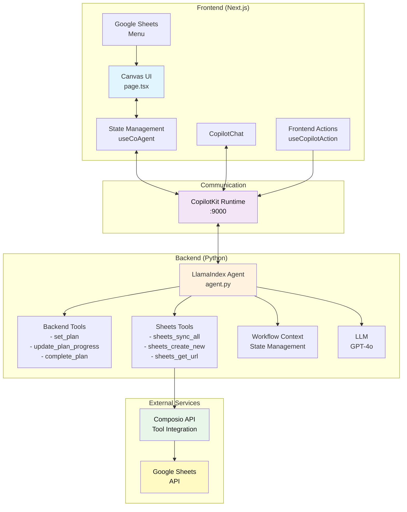
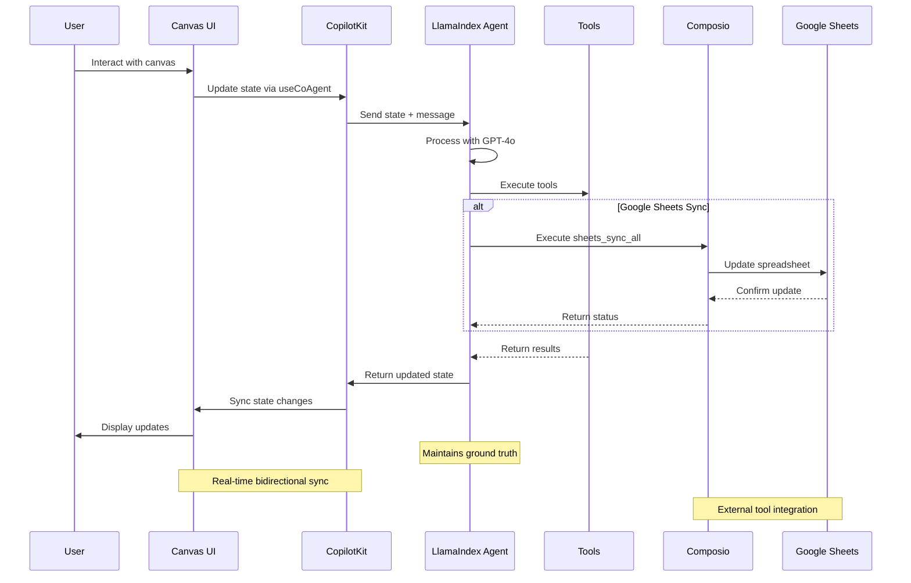

## About this project 

SteveAndBill hacakthon project is a Financial Planning & Analysis dashboard delivering a clear view of past performance and future outlook, defaulting to six months or customizable to a year. It presents market trends, identifies areas behind or ahead of forecast, and generates the top five targeted recommendations for improvement. With built-in options to contact co-workers in relevant departments, the dashboard transforms insights into immediate collaboration, helping teams act quickly to improve financial performance and business outcomes.

So, we designed it as  an AI-powered canvas application using LlamaIndex, CopilotKit, and Composio. It provides a modern Next.js application with an integrated LlamaIndex agent that manages a visual canvas of interactive cards with real-time AI synchronization and external tool integrations (Google Sheets, for this example) through Composio. For SteveandBill project, we used Google Sheets integration because hacakthon users had gmail accounts. 

Once canvas was up, we used natural language to analyze data and then send messages to Slack with Composio. 


### LlamaIndex
LlamaIndex is a framework for building generative AI applications, in particular Document Agents, i.e. agents that process unstructured data like PDFs, PowerPoints, Word files and more. The core framework has adapters for loading and storing data, while the Workflows framework provides a way to build an agent or multi-agent system and control how data moves around. Both frameworks can make use of LlamaCloud, an enterprise offering that provides RAG and structured data extraction as a service.

[LlamaIndex ->](https://composio.dev/)

### Composio
Composio is the fastest way to enable your AI agents to take real-world actions—without dealing with individual API integrations, authentication flows, or complex tool formatting. It provides access 3000+ tools out of the box across popular apps like Slack, GitHub, Notion, and more.

[More about Composio ->](https://composio.dev/)

### CopilotKit
CopilotKit connects your app's logic, state, and user context to the AI agents that deliver the animated and interactive part of your app experience — across both embedded UIs and fully headless interfaces. It gives you the tools to build, deploy, and monitor AI-assisted features that feel intuitive, helpful, and deeply integrated.

[More about CopilotKit ->](https://copilotkit.ai)

## Getting Started

This repository is designed to help you hit the ground running for the hackathon. Use it as a foundation for your project, a source of inspiration, or simply as a quick way to get started. The following steps will guide you through setting up the project locally.

### 📚 Documentation
In case you get stuck, we highly recommend checking out the documentation.
- [LlamaIndex Documentation](https://developers.llamaindex.ai/python/workflows) - Learn more about LlamaIndex and its features
- [CopilotKit Documentation](https://docs.copilotkit.ai) - Explore CopilotKit's capabilities
- [Composio Documentation](https://docs.composio.dev) - Learn about Composio's tool integrations
- [Next.js Documentation](https://nextjs.org/docs) - Learn about Next.js features and API

### 🧑‍💻 Vibe coding
Plug-in these resources to let coding agents help you and our team!
- [vibe-llama](https://github.com/run-llama/vibe-llama)
- [Copilotkit MCP](https://docs.copilotkit.ai/vibe-coding-mcp)

### Prerequisites
Before getting started, you'll need to the following.
- Node.js 20+ 
- Python 3.10+
- OpenAI API Key (LlamaIndex agent; `agent/.env`) ([platform.openai.com/api-keys](https://platform.openai.com/api-keys))
- Composio API Key & Config ID (external tool integrations; `agent/.env`) ([app.composio.dev/developers](https://app.composio.dev/developers))
- [uv](https://docs.astral.sh/uv/getting-started/installation/)
- Any of the following package managers:
  - [pnpm](https://pnpm.io/installation) (recommended)
  - npm
  - [yarn](https://classic.yarnpkg.com/lang/en/docs/install/#mac-stable)
  - [bun](https://bun.sh/)

### Quickstart

> [!WARNING]
> If you run into problems getting started, make sure you have all the [Prerequisites](#prerequisites) installed, or else it can fail.

1. Install dependencies using your preferred package manager:

    This will install both your Node and Python dependencies (using `uv`).

    ```bash
    # Using pnpm (recommended)
    pnpm install

    # Using npm
    npm install

    # Using yarn
    yarn install

    # Using bun
    bun install
    ```

    > **Note:** This repository ignores lock files (package-lock.json, yarn.lock, pnpm-lock.yaml, bun.lockb) to avoid conflicts between different package managers. Each developer should generate their own lock file using their preferred package manager. After that, make sure to delete it from the `.gitignore`.

2. Setup Googlesheets Integration

    Navigate to https://app.composio.dev/developers, setup a Google Sheet integration and grab an API key.

    For the next step you'll need a Composio API key, auth config ID, and user ID.

    <details>

    <summary>Show me how ->
    
    </summary>

    https://github.com/user-attachments/assets/159cec99-7ba2-4ee2-83dd-2d86e51afea1

    </details>

3. Set up your environment variables:

    There are two `.env` files to configure:

    #### Backend

    Copy `agent/.env.example` to `agent/.env`:

    ```bash
    # OpenAI API key
    OPENAI_API_KEY=""

    # Composio secrets
    COMPOSIO_API_KEY=""
    COMPOSIO_GOOGLESHEETS_AUTH_CONFIG_ID=""
    COMPOSIO_USER_ID="default"
    ```

    > **Note:** The OpenAI API key is required for the LlamaIndex agent to function

    #### Frontend (optional)

    Copy `.env.local.example` to `.env` in the root directory:

    ```bash
    # .env.local
    COPILOT_CLOUD_PUBLIC_API_KEY="" # optional (for CopilotKit Cloud features)
    ```

4. Start the development server:
    ```bash
    # Using pnpm
    pnpm dev

    # Using npm
    npm run dev

    # Using yarn
    yarn dev

    # Using bun
    bun run dev
    ```

    This will start both the UI and agent servers concurrently.

5. ✅ You're done!

    Open http://localhost:3000 to use the starter and try it out!

    <details>
    
    <summary>
    Using the canvas starter-> 
    
    </summary>

    Once the application is running, you can:

    1. **Create Cards**: Use the "New Item" button or ask the AI to create cards
    - "Create a new project"
    - "Add an entity and a note"
    - "Create a chart with sample metrics"

    1. **Edit Cards**: Click on any field to edit directly, or ask the AI
    - "Set the project field1 to 'Q1 Planning'"
    - "Add a checklist item 'Review budget'"
    - "Update the chart metrics"

    1. **Sync with Google Sheets**: Use the Google Sheets button or ask the AI
    - "Create a new Google Sheet" - Creates a sheet for syncing canvas data
    - "Sync all items to Google Sheets" - Syncs current canvas state to the sheet
    - "Get the sheet URL" - Retrieves the Google Sheets link

    1. **Execute Plans**: Give the AI multi-step instructions
    - "Create 3 projects with different priorities and add 2 checklist items to each"
    - The AI will create a plan and execute it step by step with visual progress

    1. **View JSON**: Toggle between the visual canvas and JSON view using the button at the bottom

    </details>

### Available Scripts
The following scripts can also be run using your preferred package manager:
- `dev` - Starts both UI and agent servers in development mode
- `dev:debug` - Starts development servers with debug logging enabled
- `dev:ui` - Starts only the Next.js UI server
- `dev:agent` - Starts only the LlamaIndex agent server
- `install:agent` - Installs Python dependencies for the agent
- `build` - Builds the Next.js application for production
- `start` - Starts the production server
- `lint` - Runs ESLint for code linting

### Architecture Overview

<details>

<summary>High-level -></summary>


</details>

<details>

<summary>Data flow -> </summary>


#### Frontend (Next.js + CopilotKit)
The main UI component is in [`src/app/page.tsx`](https://github.com/CopilotKit/canvas-with-llamaindex/blob/main/src/app/page.tsx). It includes:
- **Canvas Management**: Visual grid of cards with create, read, update, and delete operations
- **State Synchronization**: Uses `useCoAgent` hook for real-time state sync with the agent
- **Frontend Actions**: Exposed as tools to the AI agent via `useCopilotAction`
- **Google Sheets Integration**: Dropdown menu for creating sheets and syncing data
- **Plan Visualization**: Shows multi-step plan execution with progress indicators
- **HITL (Tool-based)**: Uses `useCopilotAction` with `renderAndWaitForResponse` for disambiguation prompts (e.g., choosing an item or card type)

#### Backend (LlamaIndex Agent)
The agent logic is in [`agent/agent/agent.py`](https://github.com/CopilotKit/canvas-with-llamaindex/blob/main/agent/agent/agent.py). It features:
- **Workflow Context**: Uses LlamaIndex's Context for state management and event streaming
- **Tool Integration**: Backend tools for planning, frontend tools integration via CopilotKit
- **Composio Integration**: Leverages Composio for external service connections (Google Sheets, etc.)
- **Strict Grounding**: Enforces data consistency by always using shared state as truth
- **Loop Control**: Prevents infinite loops and redundant operations
- **Planning System**: Can create and execute multi-step plans with status tracking
- **FastAPI Router**: Uses `get_ag_ui_workflow_router` for seamless integration
</details>

<details>

<summary>Schema -></summary>

#### Card Field Schema
Each card type has specific fields defined in the agent:
- **Project**: field1 (text), field2 (select), field3 (date), field4 (checklist)
- **Entity**: field1 (text), field2 (select), field3 (tags), field3_options (available tags)
- **Note**: field1 (textarea content)
- **Chart**: field1 (array of metrics with label and value 0-100)

</details>

### Concepts

<details>

<summary>Backend tools -></summary>

With LlamaIndex's `get_ag_ui_workflow_router`, you can define backend tools.

```py
def hello_world(name: str) -> str:
  return f"Hello, {str}" # tool result

agentic_chat_router = get_ag_ui_workflow_router(
    llm=OpenAI(model="gpt-4.1"),
    backend_tools=[hello_world]
)
```

You can then render this with CopilotKit's `useCopilotAction`

```tsx
// page.tsx
import { useCopilotAction } from "@copilotkit/core"

const Main = () => {
  // ...

  useCopilotAction({
    name: "hello_world"
    render: () => {
      return <div>Called hello_world tool...</div>
    }
  })

  // ...
}
```
  
</details>

<details>

<summary>Frontend tools -></summary>

With LlamaIndex's `get_ag_ui_workflow_router`, you can also define frontend tools. They get called by the agent
but handled on the frontend.

```py
def hello_world(name: str) -> str:
  return "called hello_world"

agentic_chat_router = get_ag_ui_workflow_router(
    llm=OpenAI(model="gpt-4.1"),
    frontend_tools=[hello_world]
)
```

You can then handle this tool with CopilotKit's `useCopilotAction`

```tsx
// page.tsx
import { useCopilotAction } from "@copilotkit/core"

const Main = () => {
  // ...

  useCopilotAction({
    name: "say_hello",
    description: "Say hello to the name, make sure to get it first",
    available: "remote",
    parameters: [
      { name: "name", type: "string", required: true, description: "The name to say hi to" },
    ],
    handler: ({ description }: { description: string }) => {
      return "Hello, Tyler" // tool_result
    },
  });

  // ...
}
```
  
</details>

### Customization Guide

<details>

<summary>Adding New Card Types -></summary>

1. Define the data schema in [`src/lib/canvas/types.ts`](https://github.com/CopilotKit/canvas-with-llamaindex/blob/main/src/lib/canvas/types.ts)
2. Add the card type to the `CardType` union
3. Create rendering logic in [`src/components/canvas/CardRenderer.tsx`](https://github.com/CopilotKit/canvas-with-llamaindex/blob/main/src/components/canvas/CardRenderer.tsx)
4. Update the agent's field schema in [`agent/agent/agent.py`](https://github.com/CopilotKit/canvas-with-llamaindex/blob/main/agent/agent/agent.py)
5. Add corresponding frontend actions in [`src/app/page.tsx`](https://github.com/CopilotKit/canvas-with-llamaindex/blob/main/src/app/page.tsx)

</details>

<details>

<summary>Modifying Existing Cards -></summary>

- Field definitions are in the agent's FIELD_SCHEMA constant
- UI components are in [`CardRenderer.tsx`](https://github.com/CopilotKit/canvas-with-llamaindex/blob/main/src/components/canvas/CardRenderer.tsx)
- Frontend actions follow the pattern: `set[Type]Field[Number]`

</details>

<details>

<summary>Styling -></summary>

- Global styles: [`src/app/globals.css`](https://github.com/CopilotKit/canvas-with-llamaindex/blob/main/src/app/globals.css)
- Component styles use Tailwind CSS with shadcn/ui components
- Theme colors can be modified via CSS custom properties
- See CopilotKit's [customization docs](https://docs.copilotkit.ai/llamaindex/custom-look-and-feel/customize-built-in-ui-components) for the chat window

</details>

## Troubleshooting

<details>

<summary>Setup errors -></summary>

If you encounter errors while setting up the project, make sure you have all the [Prerequisites](#prerequisites) installed. Missing prerequisites like Node.js, Python, or `uv` can cause installation or build failures.

</details>

<details>

<summary>Agent connection issues -></summary>

If you see "I'm having trouble connecting to my tools", make sure:
1. The LlamaIndex agent is running on port 9000 (check terminal output)
2. Your OpenAI API key is set correctly in `agent/.env`
3. Both servers started successfully (UI and agent)

</details>

<details>

<summary>Port already in use -></summary>

If you see "[Errno 48] Address already in use":
1. The agent might still be running from a previous session
2. Kill the process using the port: `lsof -ti:9000 | xargs kill -9`
3. For the UI port: `lsof -ti:3000 | xargs kill -9`

</details>

<details>

<summary>State synchronization issues -></summary>

If the canvas and AI seem out of sync:
1. Check the browser console for errors
2. Ensure all frontend actions are properly registered
3. Verify the agent is using the latest shared state (not cached values)

</details>

<details>

<summary>Google Sheets integration issues -></summary>

If Google Sheets sync is not working:
1. Verify your Composio API key is set correctly in `agent/.env`
2. Check if you need to authenticate with Google Sheets (the agent will provide an auth URL)
3. Ensure the `COMPOSIO_USER_ID` is set (defaults to "default")
4. For first-time setup, you may need to configure Google Sheets auth in your Composio dashboard

</details>

<details>

<summary>Python dependencies -></summary>

If you encounter Python import errors:
```bash
cd agent
uv sync
```

</details>

<details>

<summary>Dependency conflicts -></summary>

If issues persist, recreate the virtual environment:

```bash
cd agent
rm -rf .venv
uv venv
uv sync
```

</details>

---

## Contributing

Feel free to submit issues and enhancement requests! This starter is designed to be easily extensible.

## License

This project is licensed under the MIT License - see the LICENSE file for details.

> [!IMPORTANT]
> Some features are still under active development and may not yet work as expected. If you encounter a problem using this template, please [report an issue](https://github.com/CopilotKit/canvas-with-llamaindex/issues/new/choose) to this repository.
